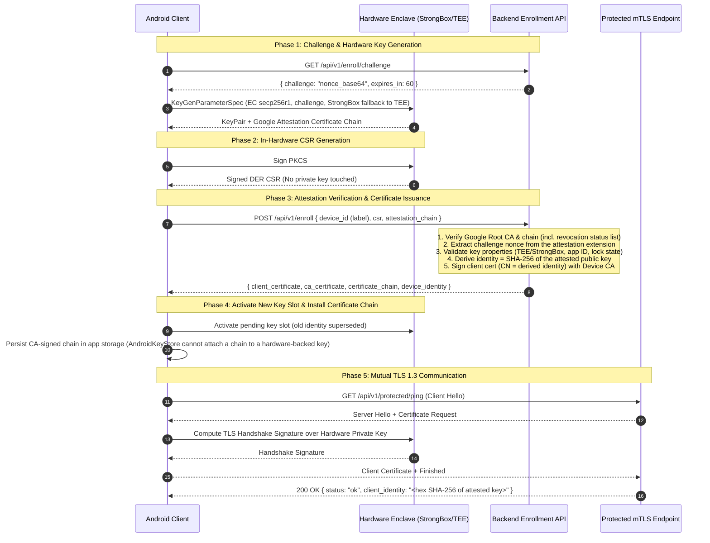

# Hardware-Backed Mutual TLS (mTLS) Proof of Concept

A production-grade Proof of Concept (PoC) demonstrating **Hardware-Backed Mutual TLS (mTLS 1.3)** on Android, utilizing **StrongBox Keymaster / KeyMint**, **Android Key Attestation**, and automated **PKCS#10 Certificate Signing Request (CSR)** generation.

---

## 📌 The Gist

**An Android app whose cryptographic identity lives exclusively in the phone's secure hardware, used to authenticate to a backend over strict mutual TLS 1.3 — no tokens, no passwords, no extractable secrets.**

1. **Challenge** — The backend issues a fresh, single-use nonce (`GET /api/v1/enroll/challenge`).
2. **Hardware key mint** — The app generates an EC `secp256r1` keypair inside the StrongBox HSM (TEE fallback). A Google-signed attestation chain proves the key is genuinely hardware-backed, and the CSR is signed *inside* the enclave — private key bytes never exist in app memory.
3. **Verified enrollment** — The backend validates the full attestation chain (hardware backing, verified boot, app ID, revocation status list), derives the device identity itself (SHA-256 of the attested public key — never trusting a client-supplied ID), and its in-process CA issues a short-lived client certificate.
4. **Mutual TLS 1.3** — The app calls the protected endpoint over TLS 1.3-only mTLS; the TLS handshake signature is computed by the secure hardware. The certificate *is* the identity, and the key *cannot* be exported.

**Stack**: Kotlin + Jetpack Compose + OkHttp client; Go backend with an in-process ECDSA P-256 CA and zero third-party dependencies.

---

## 🔒 Security Architecture & Motivation

Traditional mobile authentication mechanisms (bearer tokens, API keys, client certificates stored in software or app private files) are vulnerable to extraction via root access, memory dumping, hooking (Frida/Xposed), or supply-chain compromise.

This project implements **Zero-Trust Client Authentication** by ensuring:
1. **Hardware-Bound Private Keys**: Cryptographic key pairs (EC `secp256r1`) are generated directly inside tamper-resistant hardware (StrongBox dedicated HSM or ARM TrustZone TEE) and marked non-exportable.
2. **Zero Key Exposure**: Private key bytes never enter application memory or storage. Digital signatures (including the CSR and TLS 1.3 handshake challenge signatures) are computed entirely within the hardware enclave.
3. **Hardware Attestation**: During initial onboarding, the device proves to the backend that the key was legitimately minted inside genuine, secure Android hardware via Google's Hardware Attestation Certificate Chain.
4. **Automated Enterprise CA Enrollment**: The backend verifies attestation, extracts the device identity and public key from the CSR, and issues an X.509 client certificate signed by a trusted Enterprise CA.
5. **Seamless TLS 1.3 Client Handshake**: Android's `AndroidKeyStore` provider is integrated with OkHttp via a custom `X509ExtendedKeyManager`, allowing the OS to transparently sign client authentication challenges during the TLS 1.3 handshake.

```
+---------------------------------------------------------------------------------------------------------+
|                                              ANDROID DEVICE                                             |
|                                                                                                         |
|   +--------------------------+        +---------------------------+        +------------------------+   |
|   |       Compose UI         | <----> |       MainViewModel       | <----> |   SecurityRepository   |   |
|   +--------------------------+        +---------------------------+        +-----------+------------+   |
|                                                                                        |                |
|               +-----------------------+-------------------------+----------------------+                |
|               |                       |                         |                                       |
|               v                       v                         v                                       |
|       +---------------+       +---------------+       +--------------------+                            |
|       | KeystoreMgr   |       | CsrGenerator  |       | MtlsSocketFactory  |                            |
|       +-------+-------+       +-------+-------+       +---------+----------+                            |
|               |                       |                         |                                       |
|               | (attestation nonce)   | (in-hardware signing)   | (TLS 1.3 handshake)                   |
|               v                       v                         v                                       |
|   +-------------------------------------------------------------------------------------------------+   |
|   |                              HARDWARE ENCLAVE (AndroidKeyStore)                                 |   |
|   |       [StrongBox HSM (Titan M)  /  Trusted Execution Environment (ARM TrustZone TEE)]           |   |
|   |       • Key: EC secp256r1 (PURPOSE_SIGN | PURPOSE_VERIFY)                                       |   |
|   |       • Private Key CANNOT be exported, read, or modified                                       |   |
|   |       • Issues Google-signed Attestation Chain on generation                                    |   |
|   +-------------------------------------------------------------------------------------------------+   |
+---------------------------------------------------------------------------------------------------------+
                                                |
                                      HTTPS / mTLS 1.3
                                                |
                                                v
+---------------------------------------------------------------------------------------------------------+
|                                              BACKEND CA                                                 |
|                                                                                                         |
|   1. GET  /api/v1/enroll/challenge   --> Issues cryptographically random challenge nonce                |
|   2. POST /api/v1/enroll             --> Verifies Google Attestation Chain, Nonce, Boot State & CSR;    |
|                                          issues CA-signed X.509 Client Certificate                      |
|   3. GET  /api/v1/protected/ping     --> Authenticates device identity over Mutual TLS 1.3              |
+---------------------------------------------------------------------------------------------------------+
```

---

## 🚀 Protocol Flow



---

## 📁 Repository Structure

```
.
├── README.md                           # Project documentation and architectural guide
├── AGENTS.md                           # Instructions and guidelines for autonomous AI agents
├── android/                            # Android native client application
│   ├── app/
│   │   ├── build.gradle.kts            # App-level build config (Kotlin 2.4+, AGP 9.4+, BuildConfig BACKEND_HOST)
│   │   └── src/
│   │       ├── debug/
│   │       │   └── res/raw/debug_ca.crt      # Local Root CA for Android debug trust (generated by `make certgen`, not committed)
│   │       ├── main/
│   │       │   ├── AndroidManifest.xml      # INTERNET + ACCESS_LOCAL_NETWORK permissions
│   │       │   ├── res/xml/
│   │       │   │   └── network_security_config.xml # System CAs (prod) & @raw/debug_ca (debug)
│   │       │   └── java/com/kypeli/mtlspoc/
│   │       │       ├── MainActivity.kt # Compose entry point (wired to MainView)
│   │       │       ├── MtlsApplication.kt                  # Application + Metro DI graph
│   │       │       ├── data/
│   │       │       │   ├── api/        # EnrollmentApi & ProtectedApi (OkHttp + Moshi)
│   │       │       │   ├── model/      # Moshi JSON data classes
│   │       │       │   └── repository/ # SecurityRepository (Orchestrates onboarding & mTLS)
│   │       │       ├── di/             # AppGraph (Metro DI), Qualifiers
│   │       │       ├── security/
│   │       │       │   ├── AndroidKeystoreSigner.kt      # BouncyCastle ContentSigner bridge
│   │       │       │   ├── CsrGenerator.kt               # PKCS#10 DER CSR generator
│   │       │       │   ├── HardwareSecurityLevel.kt      # StrongBox vs TEE enum
│   │       │       │   ├── KeystoreManager.kt            # Key generation (alternating slots), attestation & storage
│   │       │       │   └── MtlsSocketFactoryBuilder.kt   # TLS 1.3 SSLContext & KeyManager
│   │       │       └── ui/
│   │       │           ├── MainView.kt                   # Compose UI
│   │       │           ├── MainViewModel.kt              # State orchestration (Coroutines + Flow)
│   │       │           └── UiState.kt                    # UI state hierarchy
│   │       └── test/
│   │           └── java/com/kypeli/mtlspoc/
│   │               ├── CsrGeneratorTest.kt               # Unit tests for CSR generation & validation
│   │               └── MtlsSocketFactoryBuilderTest.kt   # Unit tests incl. full TLS 1.3 handshake
├── android/gradle/libs.versions.toml   # Gradle version catalog
└── backend/                            # Go backend service (Dual HTTPS/mTLS listeners)
    ├── cmd/server/                     # Dual-listener server
    ├── cmd/certgen/                    # Local CA & server certificate generator
    ├── internal/
    │   ├── attestation/                # Google root pool, OID parser, policy & revocation list
    │   ├── ca/                         # ECDSA P-256 CA, CSR signing, cert bootstrap
    │   ├── config/                     # Environment-based configuration
    │   ├── handlers/                   # Challenge, enroll & protected ping endpoints
    │   ├── middleware/                 # mTLS identity/serial binding middleware
    │   └── storage/                    # Challenge store & device registry
    └── certs/                          # Generated certificates (not committed)
```

---

## 🧩 Android Implementation Details

### 1. `KeystoreManager`
- Generates standard elliptic curve keys using `KeyProperties.KEY_ALGORITHM_EC` with curve `secp256r1`.
- Proactively checks `PackageManager.FEATURE_STRONGBOX_KEYSTORE` and sets `specBuilder.setIsStrongBoxBacked(true)`.
- If StrongBox hardware is unavailable or throws `StrongBoxUnavailableException` (detected by walking the whole cause chain), automatically falls back to Trusted Execution Environment (`TEE`).
- Embeds the server's challenge nonce into the attestation extension using `.setAttestationChallenge(challenge)`.
- Generates keys under alternating alias slots: a fresh key is minted in the inactive slot and only becomes active after a successful enrollment, so a failed enrollment never destroys the existing identity.

### 2. `AndroidKeystoreSigner`
- Implements Bouncy Castle's `org.bouncycastle.operator.ContentSigner`.
- Buffers the PKCS#10 data to sign and invokes `java.security.Signature.getInstance("SHA256withECDSA")` initialized with the `PrivateKey` handle.
- Enables in-hardware CSR generation without extracting or handling private key material.

### 3. `MtlsSocketFactoryBuilder`
- Implements `javax.net.ssl.X509ExtendedKeyManager` targeting the client certificate alias.
- Overrides `chooseClientAlias`, `getPrivateKey`, and `getCertificateChain` to supply the hardware-backed key during TLS 1.3 handshake negotiation.
- Configures `SSLContext.getInstance("TLSv1.3")` and initializes trust against the custom backend CA certificate.
- The mTLS OkHttp client additionally restricts its `ConnectionSpec` to TLS 1.3 only.

### 4. `SecurityRepository`
- Coordinates the complete sequence:
  1. Requests challenge from `EnrollmentApi.getChallenge()`
  2. Generates hardware keypair via `KeystoreManager` (inactive slot)
  3. Constructs hardware-signed CSR via `CsrGenerator`
  4. Dispatches `EnrollRequest` with base64-encoded CSR and attestation chain
  5. On success, persists the CA-signed chain in app storage (public certificates only — AndroidKeyStore cannot attach a chain to a hardware-backed key), activates the new key slot, and invalidates any cached mTLS client so pings present the fresh certificate
  6. Configures authenticated `ProtectedApi` instance over mTLS 1.3

---

## 📡 Backend API Contract

The backend service exposes three primary endpoints:

### 1. Challenge Nonce Generation
* **Endpoint**: `GET /api/v1/enroll/challenge`
* **Response**:
```json
{
  "challenge": "dGhpcy1pcy1hLXJhbmRvbS1ub25jZQ==",
  "expires_in": 60,
  "expires_at": "2026-09-13T12:00:00Z"
}
```
* The challenge is 32 bytes of cryptographically random data, **single-use**, and expires after 60 seconds by default (`CHALLENGE_TTL_SECONDS`).

### 2. Device Enrollment & Attestation Verification
* **Endpoint**: `POST /api/v1/enroll`
* **Content-Type**: `application/json`
* **Request**:
```json
{
  "device_id": "optional_display_label",
  "csr": "MIIBOzCB... (Base64-encoded DER PKCS#10 CSR)",
  "attestation_chain": [
    "MII... (Base64-encoded DER leaf certificate with Android attestation extension)",
    "MII... (Intermediate certificates)",
    "MII... (Google Root CA certificate)"
  ]
}
```
* **Identity binding**: The attestation challenge is extracted from the chain (never trusted from the request). The device identity is derived **server-side** as the hex-encoded SHA-256 of the attested public key's SubjectPublicKeyInfo; `device_id` is a validated, display-only label (`^[A-Za-z0-9][A-Za-z0-9._-]{0,63}$`). The attestation chain must contain at least two certificates (leaf + Google root) unless `DEV_MODE` is enabled. Re-enrollment with a revoked identity is refused, and the mTLS middleware verifies the presented certificate's key fingerprint and serial against the registry at request time.
* **Response** (HTTP 201):
```json
{
  "client_certificate": "-----BEGIN CERTIFICATE-----\n...\n-----END CERTIFICATE-----",
  "ca_certificate": "-----BEGIN CERTIFICATE-----\n...\n-----END CERTIFICATE-----",
  "certificate_chain": [
    "-----BEGIN CERTIFICATE-----\n... (client cert PEM)",
    "-----BEGIN CERTIFICATE-----\n... (device CA PEM)"
  ],
  "device_identity": "hex-encoded SHA-256 of the attested public key",
  "device_label": "optional_display_label"
}
```

### 3. Protected Resource Access (mTLS 1.3 Required)
* **Endpoint**: `GET /api/v1/protected/ping`
* **Security**: Mutual TLS handshake required; client must present the currently issued CA-issued certificate for a registered identity. Revoked identities and superseded serials are rejected.
* **Response**:
```json
{
  "status": "ok",
  "message": "mTLS handshake verified successfully",
  "client_identity": "hex-encoded SHA-256 of the attested public key",
  "device_label": "optional_display_label",
  "cert_serial": "serial number of the presented client certificate",
  "timestamp": 1725612345
}
```

---

## 🛠️ Build & Development Setup

### Prerequisites
- **Java Development Kit (JDK)**: JDK 17+ (the Gradle daemon JVM, toolchain 25, is auto-provisioned via the foojay resolver — no manual install required).
- **Go**: 1.26+ (backend; zero third-party dependencies).
- **Android SDK**: Build Tools `37.0.0`, `compileSdk = 37`, `targetSdk = 37`, `minSdk = 29`.
- **Physical Device (Recommended)**: For StrongBox testing, a physical device equipped with a hardware security chip (e.g. Google Pixel 3+ with Titan M/M2) is required. Emulators execute under TEE or software fallback; run the backend with `DEV_MODE=true` to enroll devices without a hardware attestation chain. On Android 16+ (SDK 37) the app additionally requests the Local Network permission at runtime before connecting.

### 🔐 Development Certificates & Android Debug Trust

During onboarding, standard Android clients connect to the enrollment endpoint (`https://<host>:8080`) over standard HTTPS without any pre-shared knowledge or pinning of `server.crt`.

Generated development certificates are **never committed** to the repository: a committed CA certificate without its private key would cause the server to regenerate a mismatching trust anchor on first run. A fresh clone bootstraps everything by running `make certgen` in `backend/`.

To support frictionless local development and testing on emulators and physical devices without purchasing public Web PKI certificates:
- **Local CA & Server TLS Certificates**:
  Bootstrapped by running `make certgen` in `backend/`, which creates `backend/certs/ca.crt` (Root CA) and `backend/certs/server.crt` (SANs: `localhost`, `android.local`, `127.0.0.1`, `10.0.2.2`, `::1`, plus every non-loopback IPv4 of the host — so LAN-attached physical devices work without extra configuration).
- **Automatic Android Debug Trust (`debug_ca.crt`)**:
  `make certgen` also copies the development Root CA (`backend/certs/ca.crt`) to `android/app/src/debug/res/raw/debug_ca.crt` so the client and the generated server certificate always match. The backend server refuses to bootstrap when only a partial certificate set exists (e.g. a certificate without its key) instead of silently regenerating.
- **Network Security Config (`network_security_config.xml`)**:
  - **Release Builds (`<base-config>`)**: Strictly enforce Android's default `system` CAs. Production builds never bundle, pin, or trust private development certificates.
  - **Debug Builds (`<debug-overrides>`)**: Automatically trust `@raw/debug_ca` and `user` CAs. When building with `assembleDebug`, the app seamlessly trusts the local server certificate on `10.0.2.2:8080` (Android emulator host loopback) or `localhost:8080` out of the box with zero manual certificate installation.

> **Trust-on-first-use note**: The trust anchor for the mTLS port (`:8443`) is adopted from the enrollment response and stored in app preferences. This is safe in release builds because enrollment itself is anchored to system CAs; in debug builds it additionally relies on the bundled development CA.

### Android Client
To run unit tests:
```bash
cd android
./gradlew test
```

To build the debug APK:
```bash
cd android
./gradlew assembleDebug
```

To point the app at a different backend host (default `10.0.2.2`, the Android emulator's host loopback):
```bash
cd android
./gradlew assembleDebug -PbackendHost=192.168.1.42
```

### Backend Service (Go)
To build the server and certificate generation utility:
```bash
cd backend
make build
```

To run all backend unit and integration tests (with race detection):
```bash
cd backend
make test
```

To (re)generate the local Root CA and Server TLS certificates (`make certgen` force-regenerates a full set and re-syncs the Android debug CA; the server binary itself refuses to bootstrap when only a partial certificate set exists):
```bash
cd backend
make certgen
```

To start the dual-listener backend server (:8080 HTTPS standard TLS enrollment & :8443 mTLS 1.3):
```bash
cd backend
make run
```

The backend is configured entirely via environment variables (all optional, sensible defaults):

| Variable | Default | Purpose |
|---|---|---|
| `ENROLL_PORT` / `MTLS_PORT` | `:8080` / `:8443` | Enrollment (TLS 1.2+) and protected (mTLS, TLS 1.3-only) listeners |
| `CHALLENGE_TTL_SECONDS` | `60` | Attestation challenge lifetime |
| `CLIENT_CERT_TTL_HOURS` | `168` | Issued client certificate validity (7 days) |
| `DEV_MODE` | `false` | Relaxes attestation verification for emulators / devices without hardware attestation |
| `EXPECTED_APP_PACKAGE` | `com.kypeli.mtlspoc` | Attestation application-ID binding (tag 709) |
| `MIN_OS_VERSION` / `MIN_PATCH_LEVEL` | `0` (disabled) | Optional minimum OS version / patch level policy |
| `ATTESTATION_REVOCATION_LIST_URL` | Google's attestation status list | Fail-closed revocation check for attested keys |
| `REQUIRE_REVOCATION_CHECK` | `true` (unless `DEV_MODE`) | Toggle revocation list enforcement |

---

## 🗺️ Roadmap & Next Steps

- [x] Hardware-backed keypair generation with StrongBox and TEE fallback
- [x] Attestation challenge embedding
- [x] In-hardware PKCS#10 CSR signing via Bouncy Castle `ContentSigner`
- [x] TLS 1.3 `SSLSocketFactory` and `X509ExtendedKeyManager` integration
- [x] Complete client-side security repository and state machine
- [x] Unit test suite for CSR generation, SSL context construction, and a full TLS 1.3 handshake
- [x] **Backend Service Implementation**: Production-grade Go backend with Google Attestation parsing (OID `1.3.6.1.4.1.11129.2.1.17`), revocation status list checking, attestation application ID / OS version / patch level policy, in-process ECDSA P-256 CA, server-derived device identity binding, standard TLS enrollment on port 8080, and strict mTLS 1.3 listener on port 8443.
- [x] **Interactive Compose UI**: `MainViewModel` wired into `MainActivity`/`MainView` with enrollment state display, hardware security indicator, and a combined Connect action (enroll if needed, then ping).
- [ ] **Persistent device registry & challenge store**: Both are currently in-memory; swap for a durable store before production use.
- [ ] **CRL/OCSP endpoints**: Publishing a CRL for the device CA would let the TLS layer reject revoked client certificates even when the registry is unavailable.
